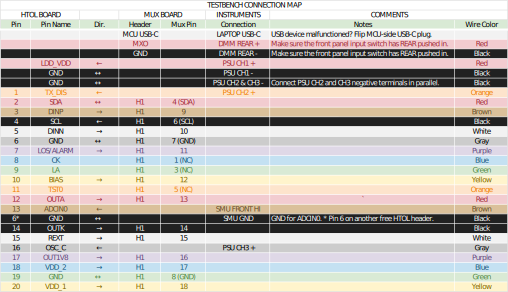

# LT7301 ESD/LU

> Mux Board Revision: 0.4  
> MCU: M5STAMP-C3 K056

?> The test program can be run using either **mux1** or **mux2** because it only needs H1 connections.

## Setup

## Troubleshooting

### OSC_C (oscillator control) not working

1. The HTOL board's MOSFET only fully turns on when V_GS > 5V (the test program uses 5.3V) is applied to OSC_C.

### LT7301 reset oddities

1. Don't use the "I2C logic reset" bits in register 0x02. If needed, write 0b11 to 0x02[1:0] to reset registers to default.
1. Don't forget to clear the alarm reset bit (set to 0) after setting it (set to 1) to clear an LOS/ALARM flag. While the alarm reset bit is 1, the LOS/ALARM status bits will always be 0.

### ADC current readings are wrong

1. Desolder R23A from the bottom of the HTOL board and use the SourceMeter to force current into ADCIN0.
1. Don't forget to solder R23A back in place before using the board for HTOL.
